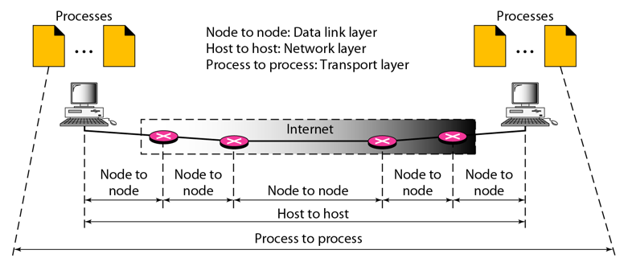

# WORKSHOP ADMINISTRASI JARINGAN

## TUGAS REVIEW

### Disusun Oleh:
**Nama**: Fransiska Elsa D. M  
**Kelas**: D4 IT A  
**NRP**: 3123600006  

---

## Analisa file `http.cap`

### Versi HTTP
1. Di kolom **"Display Filter"** ketik `HTTP` untuk menampilkan hanya paket HTTP.
2. Klik pada salah satu paket HTTP.
3. Buka bagian **Hypertext Transfer Protocol**.
4. Tertera bahwa versi HTTP yang digunakan adalah **HTTP/1.1**.

---

### IP Address Client dan Server
Lihat pada bagian **source** dan **destination** atau **Internet Protocol**.
- **IP Client**: `145.254.160.237`
- **IP Server**: `216.239.59.99`

---

### Waktu dari Client Mengirimkan HTTP Request
Lihat pada bagian **HTTP request GET /download.html** pada kolom **Time**.
- Client (`145.254.160.237`) mengirimkan request pada **0.911310 detik**.

---

### Waktu dari Server Mengirimkan Respon dan Durasinya
Lihat pada bagian **HTTP OK** pada kolom **Time**.
- Server (`216.239.59.99`) mengirimkan request pada **3.955688 detik**.
- **Durasi:**  3.955688 - 0.911310 = 3.044378 detik

---

## Analisis Type of Data Deliveries

### 1. **Node to Node (Data Link Layer)**
- Komunikasi terjadi antar perangkat jaringan (**switch, router**) dalam satu segmen jaringan.
- Menggunakan **MAC Address** untuk mengidentifikasi perangkat dalam jaringan lokal.

### 2. **Host to Host (Network Layer)**
- Menghubungkan satu **host** ke **host lain** dalam jaringan yang lebih luas (**misalnya internet**).
- Menggunakan **IP Address** untuk menentukan alamat sumber dan tujuan.

### 3. **Process to Process (Transport Layer)**
- Memastikan komunikasi terjadi antar aplikasi atau proses di perangkat sumber dan tujuan.
- Menggunakan **port number** untuk menentukan aplikasi yang menerima data.

**Kesimpulan:**  
Komunikasi jaringan berlangsung secara bertahap dari **node ke node** (antar perangkat dalam jaringan), lalu **host ke host** (antar komputer dalam internet), hingga akhirnya sampai pada **process ke process** (antar aplikasi atau layanan dalam perangkat).

---

## TAHAPAN TCP

### 1. **Establishment – Three-Way Handshake**
Memastikan kedua perangkat siap berkomunikasi sebelum mengirim data.
1. **SYN (Synchronize)**: Client mengirimkan permintaan koneksi ke server.
2. **SYN-ACK (Synchronize-Acknowledge)**: Server merespons dengan persetujuan.
3. **ACK (Acknowledge)**: Client mengonfirmasi sehingga koneksi terbentuk.

### 2. **Data Transfer**
- Setelah koneksi terjalin, data dapat dikirim antara client dan server.
- Menggunakan **TCP segments** dengan nomor urut (**sequence number**) untuk memastikan urutan data benar.
- Jika ada paket hilang, **TCP** akan meminta pengiriman ulang.
- **TCP** menggunakan mekanisme **flow control** dan **congestion control** untuk menghindari kelebihan beban jaringan.

### 3. **Termination – Four-Way Handshake**
Proses ini mengakhiri koneksi **TCP** dengan aman setelah data selesai dikirim:
1. **FIN (Finish)**: Salah satu pihak (client/server) mengirim permintaan untuk mengakhiri koneksi.
2. **ACK**: Pihak lain mengakui permintaan tersebut.
3. **FIN**: Pihak lain juga mengirim permintaan untuk menutup koneksi.
4. **ACK**: Koneksi benar-benar ditutup setelah pihak pertama mengonfirmasi.
